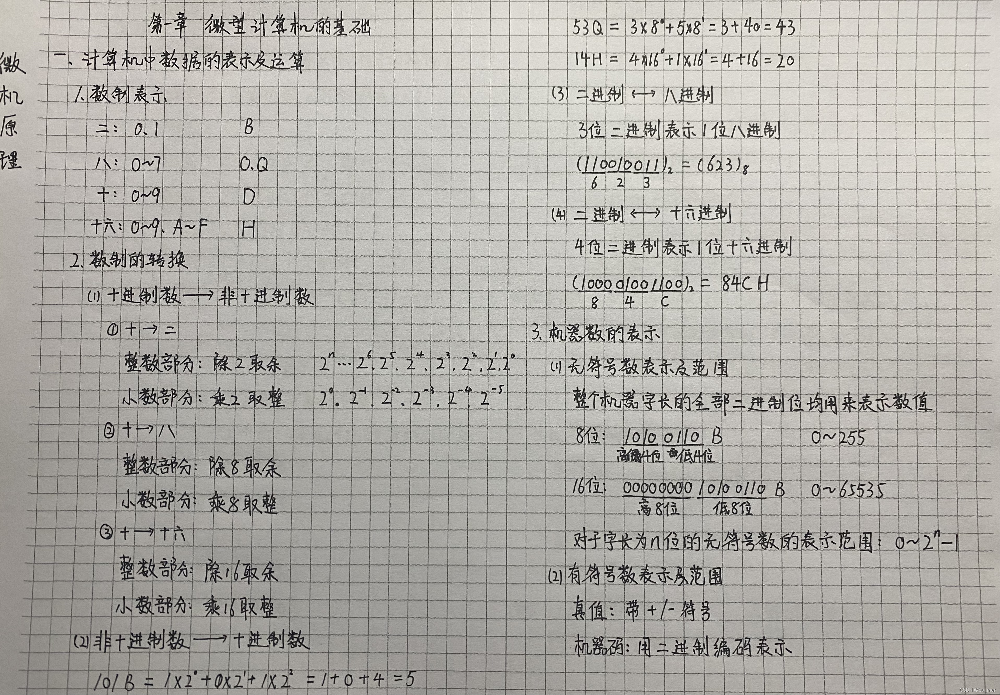
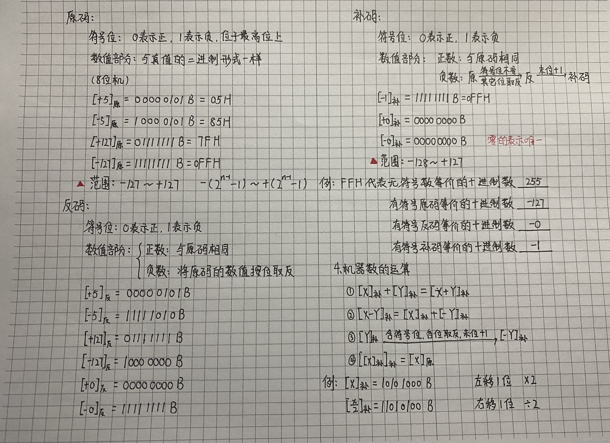
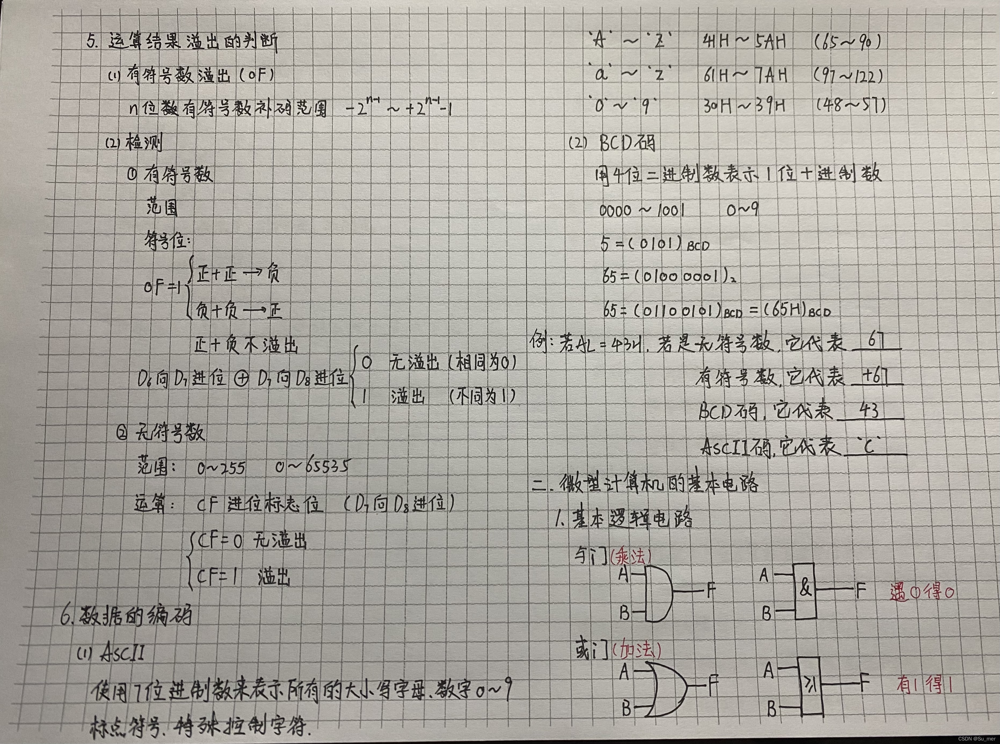

## 微型计算机的概述

### 计算机的发展

1. 1946 : ==ENIAC== ==电子管== 
2. 1958：==晶体管== 
3. 1964：==中小规模集成电路== 
4. 1971：==大规模和超大规模集成电路==， 出现了==微型计算机==
5. 1986：==巨大规模集成电路==，单边机

### 微型计算机的发展

* 1971年，世界上第一个微处理器芯片==Intel 4004==，
* *16只针脚，2250个晶体管。*
  * 第一代：4位和低档8位微机（8008）
  * 第二代：中高档8位微机：8085
  * 第三代：16位微机
    * ==8088->8086->80286==

### 微机的主要性能指标

1. 字长：
   1. 指cpu一次同时传送和处理的二进制数码的位数。
   2. 计算精度和处理能力
   3. 位：bit，1位二进制数码
   4. 字节：Byte=8位
   5. 字：word，16、32、64位
2. 主存容量
   1. 主存所能存储的二进制数码的==位数==。使用==字节==作为基本单位
3. 主频
   1. cpu的时钟频率，单位HZ
   2. 主频的倒数是==时钟周期==单位==S==，用==T==表示
   3. ==1KHZ=10^3^ 1MHZ=10^6^ 1MGHZ=10^9^==
   4. ==1ms=10^-3^ 1ns=10^-9^ 1us=10^-6^==

### 微型计算机的系统组成

1. 概念：
   1. 微型计算机系统组成(==MCS==)
      1. 微型计算机（==MC==）
         1. 微处理器（==MP==）
            1. 运算器、控制器、寄存器组
         2. 内存、总线、输入输出接口电路
      2. 外部设备和软件
      3. 
2. 五大部件
   1. TODO图
   2. TODO
3. 总线（==BUS==）
   1. 概念：传递信息的一组公用导线，是计算机各部件间传送信息的==公共通道==
   2. 类型
      1. ==按照链接的部件==
         1. *片内总线*：CPU内部各部件之间链接的总线。
            1. ALU
            2. CU
            3. R
         2. 系统总线：CPU和系统中告诉功能部件相互连接的总线。
         3. 外部总线：通讯总线，中低速I/O设备相互连接的总线。
      2. ==按照传送信息种类系统总线==
         1. 地址总线：
         2. 数据总线
         3. 控制总线
      3. ==按照数据传输方式==
         1. 串行总线：USB
         2. 并行总线：主板上系统总线和PCI
      4. ==按总线标准==
         1. USB（通用串行总线）：外设总线标准
            1. 特点：
               1. 热插拔
               2. 支持多个不同设备
               3. 独立供电
   3. 总线的性能指标
      1. 总线带宽：
         1. 数据传输率，单位：bps
      2. 总线位宽：
         1. 同时传输的二进制位数；一次所能并行传送信息的位数，称为数据通路宽度
         2. 总线工作频率：
            MHZ

### 冯诺依曼计算机设计思想

1. 五大部件：
2. 二进制：从器件的角度容易实现
3. 设计思想：存储程序，自动控制
   1. 实现编辑程序，将程序放在主存中；
   2. cpu能自动从主存中取指令并执行。

### 数据的表示及运算

1. 

